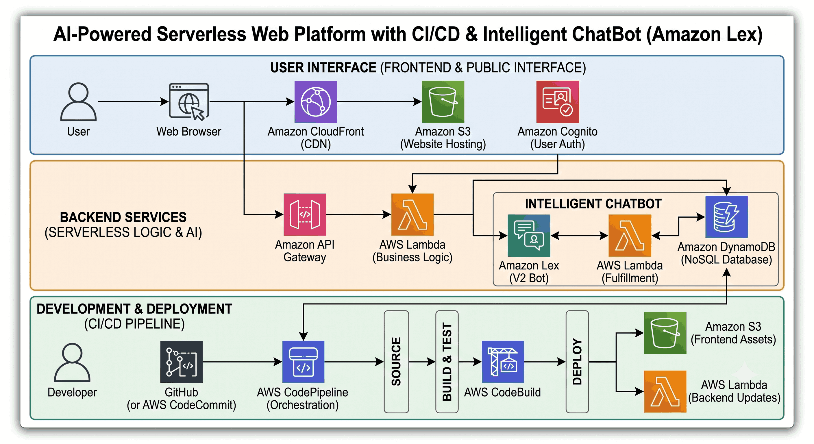

# 🌐 AI-Powered Serverless Web Platform with CI/CD & Intelligent ChatBot (Amazon Lex)

## 🎥 Project Demonstration
Watch the full automated deployment and AI chatbot interaction here:  
**[▶️ Watch Project Video on My Portfolio](https://waves.in/project01.html)** 

## 📋 Project Overview
This project demonstrates a fully automated, secure, and intelligent serverless web application built using modern AWS services. The architecture combines static website hosting, global content delivery, CI/CD automation, REST API integration, chatbot intelligence, backend processing, monitoring, and alerting — following enterprise cloud best practices. 

The website is hosted privately on Amazon S3 and delivered globally through Amazon CloudFront using Origin Access Control (OAC) for enhanced security. The deployment process is fully automated using AWS CodePipeline integrated with GitHub, ensuring continuous delivery. The platform also integrates an AI chatbot powered by Amazon Lex, backend logic through AWS Lambda, API exposure using Amazon API Gateway, and contact form data storage in Amazon DynamoDB.

**Project Context:** Intelligent AI ChatBot & Serverless Platform  
**Timeline:** 8 Weeks (Logic Design & Integration)  
**Environment:** Advanced AI & Serverless Ecosystem  
**Core Tech Stack:** Amazon S3, CloudFront, AWS CodePipeline, GitHub, Lambda, Python, DynamoDB, Amazon Lex, CloudWatch, SNS, SES, IAM, API Gateway  

## 🎯 Objectives
- Deploy a secure static website using a serverless architecture.
- Enable global content delivery with CDN acceleration.
- Automate deployments using a CI/CD pipeline.
- Integrate conversational AI chatbot functionality (Amazon Lex).
- Implement REST APIs for secure backend communication.
- Securely store user contact form data.
- Implement comprehensive monitoring, logging, and alerting mechanisms.
- Follow enterprise-grade security and IAM best practices.

## 🌍 Environment Details
- ☁️ **Cloud Platform:** Amazon Web Services (AWS)
- ☁️ **Architecture Type:** Fully Serverless & Event-Driven
- ☁️ **Frontend Hosting:** Amazon S3 (Private Bucket)
- ☁️ **Content Delivery Network:** Amazon CloudFront with Origin Access Control (OAC)
- ☁️ **Version Control:** GitHub
- ☁️ **CI/CD Pipeline:** AWS CodePipeline
- ☁️ **Backend Compute:** AWS Lambda
- ☁️ **API Management:** Amazon API Gateway (REST API)
- ☁️ **Database:** Amazon DynamoDB
- ☁️ **AI Chatbot Service:** Amazon Lex
- ☁️ **Monitoring & Logging:** Amazon CloudWatch
- ☁️ **Notifications & Alerts:** Amazon SNS & Amazon SES
- ☁️ **Security Controls:** IAM Roles, HTTPS Encryption, Least-Privilege Access

## 🏗️ Architecture Diagram

## 🧱 Architecture Components
- 🏗️ **Amazon S3 (Static Website Storage):**
  - Private bucket hosting static website files (HTML, CSS, JS)
  - Public access completely blocked; acts strictly as origin for CloudFront
- 🏗️ **Amazon CloudFront (CDN) & OAC:**
  - Distributes content globally with low latency via HTTPS
  - Origin Access Control (OAC) prevents bypassing the CDN layer
- 🏗️ **GitHub & AWS CodePipeline (CI/CD Automation):**
  - Automatically detects code changes in GitHub
  - Builds and deploys updated files to S3, ensuring continuous delivery without manual uploads
- 🏗️ **Amazon API Gateway & AWS Lambda:**
  - Exposes REST endpoints to securely handle frontend requests
  - Event-driven Lambda functions process chatbot interactions and backend logic
- 🏗️ **Amazon DynamoDB:**
  - Fully managed NoSQL database for storing contact form submissions
- 🏗️ **Amazon Lex (AI Chatbot Service):**
  - Provides a conversational AI interface and processes user queries intelligently
- 🏗️ **CloudWatch, SNS & SES (Monitoring & Notifications):**
  - Captures logs, tracks API performance, and triggers alarms
  - Sends email notifications for system alerts and contact form confirmations
- 🏗️ **IAM Roles & Policies:**
  - Enforces least-privilege access across all interconnected AWS services

## 🔁 Traffic Flow
1. **Frontend Access:** Users access the website through CloudFront, which securely retrieves content from the private S3 bucket using OAC.
2. **Interaction & API Call:** When a user interacts with the chatbot or submits a form, the request is sent to API Gateway.
3. **Backend Processing:** API Gateway invokes Lambda functions to execute the logic.
4. **Data Storage:** Processed data is securely stored in DynamoDB.
5. **Continuous Deployment:** Any code updates pushed to GitHub automatically trigger CodePipeline to redeploy the frontend.
6. **Observability:** System logs and metrics are captured in CloudWatch, with alerts delivered via SNS/SES.

## 🔐 Security & Best Practices Implemented
- 🛡️ S3 bucket public access is completely blocked.
- 🛡️ CloudFront OAC successfully restricts direct bucket access.
- 🛡️ IAM roles configured strictly following the least-privilege principle.
- 🛡️ Secure HTTPS communication enforced across all endpoints.
- 🛡️ Centralized monitoring, automated alerting, and CI/CD minimize operational risks.

## 🧪 Validation & Testing
- [x] Verified CloudFront distribution delivers content globally.
- [x] Confirmed S3 bucket is strictly not publicly accessible.
- [x] Tested CI/CD pipeline by pushing updates to GitHub.
- [x] Validated accurate chatbot responses through Amazon Lex.
- [x] Confirmed API Gateway successfully triggers Lambda functions.
- [x] Verified contact form data is stored correctly in DynamoDB.
- [x] Tested CloudWatch alarms triggering SNS & SES notifications.

## 💡 Key Learnings & Why This Project Matters
Through this project, I gained hands-on experience designing a complete serverless cloud architecture integrating CDN delivery, CI/CD automation, AI chatbot services, REST API development, backend data storage, and operational monitoring. 

This project reflects real-world DevOps and serverless architecture practices used in modern cloud environments. It demonstrates automation, scalability, security, AI integration, and operational monitoring — showcasing the ability to design and implement production-ready intelligent web applications in AWS.
